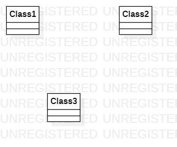

# 实验一

## 实验目标

1.熟悉GitHub环境

2.熟悉StarUML的使用

## 实验内容

1.创建并提交第一个建模文档

## 实验步骤

1.Fork项目

2.克隆项目到本地

3.在本地创建文件夹及文件

4.将文件提交到GitHub

5.发送结果到主项目库

6.在StarUML中画图

７.将UML图导出为图片

８.将图片推送到GitHub

９.在建模文档中使用所提交的图片，完成实验报告

## 实验结果

选题：稿稿网

功能：1.发布买稿信息     2.卖稿

